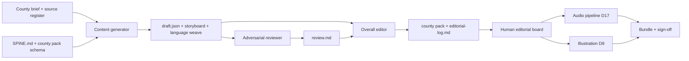

# Content Pipeline

*Repeatable process for authoring An Turas county stories as versioned packs.
Distilled from Chapter 2 (*Oileán na Naomh*), July 2026; reframed for the county-led
model on 10 July and for Story and Learning modes on 15 July. Complements
`COUNTY-ATLAS.md` (the learner-facing contract), `SPINE.md` (sequencing),
`STORY-LEARNING-REBUILD-PLAN.md` (active implementation), `Models.swift` (schema),
and D7/D9/D12/D17/D21/D22.*

## What this is

An Turas is a **content company with an app attached**. Each county is structured data
(currently split between legacy `chapterN.json` and hard-coded Swift, migrating to one
versioned county pack) that must pass three editorial passes before it ships:

1. **Content generator** — draft the chapter from the spine
2. **Adversarial reviewer** — stress-test the draft; assume it has errors
3. **Overall editor** — integrate fixes into production JSON

Human editorial board sign-off (pedagogue + historian) sits **after** this pipeline,
not instead of it. The pipeline's job is to arrive at *reviewable* content, not to
replace native-speaker and expert review.

---

## The three roles

### 1. Content generator

**Job:** Turn a county-story brief, source register, `SPINE.md`, and the current county
pack schema into a complete first draft for both modes. The county brief is not
optional: it prevents an era from being decorated with a generic scene rather than
rooted in a real place.

**Must read before writing:**

| File | Why |
|------|-----|
| `ios/AnTuras/Resources/chapter1.json` | Tone, pacing, page-type mix |
| `ios/AnTuras/Models.swift` | Valid page types and fields |
| `docs/SPINE.md` | Language payload, grammar notes, artifact, seanfhocal |
| `docs/COUNTY-ATLAS.md` | Required anchor, reading, vocabulary, source, and review contract |
| `docs/STORY-LEARNING-REBUILD-PLAN.md` | Mode behavior, representative-slice sequence, quality gates |
| `docs/COUNTY-STORY-SLATE.md` | Research lead only; identify the row's gaps before treating it as a brief |
| `ios/AnTuras/Resources/journey.json` | Place, era, hook, artifact metadata |

**Outputs:**

| File | Purpose |
|------|---------|
| `content/<county>/draft.json` | First full county-pack draft |
| `content/<county>/storyboard.md` | Chapter map, both mode projections, dramatic changes, timing |
| `content/<county>/language-weave.md` | 20-word need, first use, production, and delayed reuse |
| `content/<county>/source-register.md` | Anchor, source provenance, reading/rights status, historical uncertainties, reviewer names |

**Generator constraints:**

- Variable chapter and page counts determined by the story. Mayo targets eight to ten
  chapters and 60–90 minutes in Story mode; other launch counties normally require at
  least six chapters and 45 minutes. Fixed three-beat chapters are not permitted as a
  production shortcut.
- Author one stable page sequence with `storyOnly`, `learningOnly`, and `both`
  visibility. Story mode carries the complete account; Learning mode retains every
  chapter's causal chain and all required exercises.
- One named county anchor is visible in the title, hook, and map card; do not lead
  with an invented worker, child, or guide.
- A substantial reading/encounter is central to the chapters. Mark myth, hagiography,
  partisan sources, and archaeological inference accurately rather than smoothing them
  into historical fact.
- Build exactly **20 target words**; prove that each is heard in meaningful context,
  retrieved, used in a phrase or sentence, and reused in a later chapter. The story
  earns the words; exercises do not introduce a disconnected vocabulary list.
- Start `source-register.md` before drafting. Do not use a modern translation, image,
  poem, or archive item whose rights status is unknown.
- Delayed retrieval begins only after the story has introduced the language. Do not
  force every later chapter to open with the same mechanic.
- Scene pages only get `"image"` slugs (D8)
- Speech beats: `s`, `who`, `g`, `ph`
- The final chapter closes the historical and language movement, returns to the
  present where appropriate, completes the learner-made artifact, and hands back to
  the atlas.
- Include `"visits"` array (5–7 items) for Ar Ais
- Connacht forms first; tag dialect variants in glosses (D2)
- Do not invent continuity from prior chapters unless established in content
- Author 30–45 exercises for Mayo and an equivalent learning load for each county's
  scope. Each county uses at least seven mechanic families; no family exceeds 25% or
  repeats consecutively. At least half of exercises use phrases or sentences, at least
  40% require active production, recognition multiple choice is at most 25%, and
  single-word listen-and-pick is at most 10%.
- Every exercise records its learning objective, answer, distractor rationale,
  diagnostic feedback, recovery, and required audio or input resources.

---

### 2. Adversarial reviewer

**Job:** Attack the draft. Be specific, not polite. Cite chapter and page ids/types,
and exact Irish phrases.

**Review dimensions:**

| Dimension | What to look for |
|-----------|------------------|
| Irish language | Grammar, mutations, fadas, word order, Connacht forms, calques |
| Pedagogy | TEG level, grammar-when-story-needs-it, exercise progression, orphaned vocab |
| History | Anachronisms, false attribution, placename etymology, present-day claims, anchor/source fit, fact-versus-legend framing |
| Schema | Valid types/fields, images only on scenes, visits decode against `Models.swift` |
| Narrative | Substantial duration, causal chapters, hooks and consequences, no vocabulary filler |
| Modes | Story projection complete; Learning projection coherent; no orphaned or premature exercise |
| Exercises | Lifecycle coverage, varied mechanics, phrase/sentence depth, plausible errors, diagnostic recovery |
| Pipeline | Full SPINE payload, 20-word proof, source register, artifact concept, fin tease, app wiring gaps |

**Output:** `content/<county>/review.md` with this structure:

```markdown
## Verdict
[PASS WITH REVISIONS | MAJOR REWORK NEEDED | REJECT]

## Critical (must fix before ship)
## High (should fix)
## Medium (editor's call)
## Low / nit
## Strengths (keep these)
## Payload coverage checklist
```

**Severity definitions:**

| Level | Meaning | Who fixes |
|-------|---------|-----------|
| **Critical** | Wrong history, wrong Irish that would embarrass us publicly, schema break, visit frame/answer contradiction, false continuity | Overall editor before merge; human board must see zero Criticals at ship |
| **High** | SPINE payload gap, orphaned taught vocab, dialect pivot unexplained, exercise design flaw | Overall editor in same pass |
| **Medium** | Editorial judgment — illustration budget, drill density, tone nits | Editor fixes if clear; else defer to board |
| **Low** | Polish — missing `who`, pronunciation nit, hook payoff gap | Optional |

---

### 3. Overall editor

**Job:** Synthesise draft + review into a production county pack.

**Must fix:** all Critical and High issues. Address Medium where the fix is clear
without board debate. Preserve strengths flagged in review.

**Outputs:**

| File | Purpose |
|------|---------|
| `ios/AnTuras/Resources/CountyStories/<story-id>.json` | Production county pack; exact migration path may change with the schema implementation |
| `content/<county>/editorial-log.md` | Draft → final changes; deferred items |

**App wiring (required per county):**

- Validate the county pack and include it in the Xcode resources boundary.
- Register the story id and explicit migration from any legacy chapter or beat ids.
- Exercise both mode projections in the app. A content pack is not ready for the next
  tester build merely because it decodes.

---

## Workflow



**Order is strict:** generator → reviewer → editor. The reviewer and editor both
need the draft; the editor must read the review before writing final JSON.

---

## Definition of good enough

Good enough is **not** "perfect Irish" or "historian signed off." It is the bar for
merging chapter JSON into the repo and handing it to the human board.

### Generator draft — good enough to review

- [ ] Valid JSON; all page types decode per `Models.swift`
- [ ] Every chapter changes the dramatic answer, has a consequence, and has an
      authored exit
- [ ] Story mode is complete; Learning mode retains every chapter's causal chain
- [ ] Internal timing meets the county target without relying on exercise delay
- [ ] Every SPINE headline payload item appears somewhere in the chapter
- [ ] Named county, real anchor, significant reading/encounter, and 20-word plan meet
  `COUNTY-ATLAS.md`; source/rights uncertainties are logged
- [ ] Grammar explanation appears only where it enables the next action or clarifies a
      contrast the learner has met
- [ ] Artifact, seanfhocal, present-day beat, fin tease to next chapter present
- [ ] 5–7 visits authored
- [ ] Scene image slugs are placeholders, clearly named (`chN-*`)
- [ ] Irish is *plausible* Connacht — flagged as pending pedagogue review
- [ ] The 20-word lifecycle table has no missing need, first use, production, or later
      reuse cell
- [ ] Exercise distribution meets the mechanic, sentence, production, and recognition
      limits
- [ ] Every required exercise has a plausible wrong answer and recovery

**Not required in draft:** illustration assets, TTS clips, app integration beyond schema,
human sign-off.

### Adversarial review — good enough to edit

- [ ] Verdict stated
- [ ] Every Critical issue has chapter + page id/type + exact phrase cited
- [ ] Payload checklist completed (use `[x]`, `[~]`, `[ ]`)
- [ ] Strengths listed (so editor preserves them)
- [ ] App/pipeline gaps called out separately from content issues

**Not required:** fixing issues (reviewer does not edit JSON).

### Overall editor pass — good enough to merge

- [ ] **Zero unresolved Critical content issues** (app-only Criticals documented and deferred)
- [ ] **Zero unresolved High content issues**
- [ ] Source register records the reviewed reading, factual caveats, and rights state
- [ ] Story and Learning projections are causally complete and contain no duplicate or
      unreachable required page
- [ ] The generated quality report passes narrative timing, 20-word lifecycle,
      exercise distribution, audio-reference, and evidence-reference checks
- [ ] `editorial-log.md` lists resolved vs deferred items with reasons
- [ ] The county-pack validator passes and the JSON is valid
- [ ] Story registration, resource inclusion, and legacy migration are implemented
- [ ] The approved editorial tone and register are preserved

**Not required for an internal content merge:** final audio generation or production
scene art. Both remain required for tester readiness. Missing app integration,
migration, or a complete mode projection cannot be deferred into a tester build.

### Human board — good enough to ship publicly

- [ ] Qualified Irish-language pedagogue sign-off on all speech and exercises
- [ ] Historian sign-off on era, attribution, present-day beat
- [ ] Historian confirms the anchor/reading framing and any myth, hagiography, or
  contested-history labels
- [ ] Audio: selected project voice generate → native QA → bundle (D17)
- [ ] Scene illustrations at production recipe where briefed (D8)
- [ ] Integrated app QA: both modes load and switch without lost progress; Story
      completion advances without gold; Learning completion awards gold and review
- [ ] Direct accessibility and physical-device inspection covers every exercise family
- [ ] No open Critical or High items in review doc

---

## Payload coverage checklist

Copy into every `review.md`. Mark each item:

- `[x]` — taught and exercised adequately
- `[~]` — present but under-drilled or partially deferred
- `[ ]` — missing

Derive items from the county brief plus its `SPINE.md` rail (language payload + grammar
notes + artifact + seanfhocal + present-day beat). Add the 20-word grid and reading
verification before the Chapter 2-style payload list:

- [ ] county and map identity named
- [ ] named real anchor is in title/hook/reading
- [ ] reading kind and source are recorded; factual caveats visible
- [ ] target vocabulary = exactly 20 distinct headwords
- [ ] all 20 words have dramatic need, meaningful first use, phrase/sentence
      production, and delayed reuse
- [ ] Story-mode timing meets the county target
- [ ] Learning mode retains every chapter's setup, turn, consequence, and evidence
      limit
- [ ] at least seven exercise families; none over 25% or repeated consecutively
- [ ] at least half of exercises use phrases/sentences and at least 40% require active
      production
- [ ] recognition multiple choice ≤25%; single-word listen-and-pick ≤10%

- [ ] tá + VSO present tense
- [ ] daily routine verbs
- [ ] time / monastic hours
- [ ] numbers 1–10
- [ ] colours (inks)
- [ ] food
- [ ] is maith liom / ní maith liom
- [ ] VSO grammar note
- [ ] tá vs is mise note
- [ ] seanfhocal (named in SPINE)
- [ ] artifact (named in SPINE)
- [ ] present-day beat (named in SPINE)

**Rule:** if prose teaches a word, an exercise must retrieve it — or the review must
flag it as `[~]` with justification. Chapter 2 caught orphaned *buí*, *bainne*, and
monastic hour names this way.

---

## File layout per county

```
content/<county>/
  storyboard.md       # Generator/editor: chapter map and both mode projections
  language-weave.md   # Generator/pedagogue: 20-word lifecycle
  source-register.md  # Research/editor: claims, sources, rights, review state
  draft.json          # Generator: first draft (immutable after review starts)
  review.md           # Reviewer: adversarial pass
  editorial-log.md    # Editor: draft → final changelog

ios/AnTuras/Resources/CountyStories/
  <story-id>.json     # Editor: production county pack
```

Keep pipeline artifacts. They are the audit trail for the human board and for
regression when SPINE or schema changes.

---

## Lessons from Chapter 2

These are the failure modes the pipeline caught. Build them into prompts and checklists.

### History

- **Do not conflate the learner's artifact with a famous survivor.** The Book of Kells
  beat must say gospel books *like theirs* survived — not that *their* book is Kells.
- **Check dates of buildings and objects.** Clonmacnoise round tower ~1124 CE — not
  visible in a c. 780 scene.
- **Separate foreshadow from attribution.** Pangur Bán's poem is 9th-century; Reichenau
  copies are later. The cat can appear; the poem can be foreshadowed — not pre-copied.

### Irish

- **Mass nouns and likes:** *Is maith liom mil* — not *an mil*.
- **Lens pages are placename lessons.** Verify etymology (*Cluain Mhic Nóis* = meadow
  of sons of Nós; Ciarán founded the site — not "Mac Nóis" as a saint).
- **No English inside Irish model sentences.** *an salm* not *an psalm*.
- **A1 learners need full clauses.** Ellipsis in literary English narration is fine;
  Irish speech beats need explicit *tá*.

### Continuity

- **Never invent kinship or callbacks.** "Murchadh's distant cousin Dáire" was
  fabricated and would read as a bug. Bridge eras in narration; cite only what prior
  chapters established.

### Visits (Ar Ais)

- **Frame must match answer.** "Mid-morning" frame with "six o'clock" answer fails.
- **Location strings must match scene sluglines.** *i seomra na ndath* not *sa seomra ndath*.

### Pedagogy

- **Align word-class in lists.** *Obair* is a noun; don't put it beside imperatives
  without teaching *Tá mé ag obair*.
- **Dialect pivots need bridges.** If Chapter 1 taught *Cé thusa?*, Chapter 2 must
  explain *Cé tusa?* / *Cé thú?* — or stay on the established form.
- **Teach before listen.** Don't ask learners to identify a seanfhocal by ear before
  the scene speaks it.

### App vs content

- **JSON `artifact` page ≠ working artifact UI.** Chapter 2 JSON is valid; ogham
  `ArtifactView` still renders Chapter 1. Log as deferred app work, not a content fix.
- **ContentLoader alone is not integration.** AppState, visits merge, and map unlock
  are separate product tasks.

---

## Prompting sub-agents

When running this pipeline with agents, give each role:

1. Explicit input file paths (must-read list above)
2. Exact output file paths
3. The severity taxonomy and good-enough gates
4. Instruction to return: verdict, issue counts, top fixes, confirmation files written

Do not combine roles in one pass — the reviewer must not have written the draft.

---

## What comes after the pipeline

### Phase 3 county-pack boundary

The current schema-version-1 `LaunchCountyPackEnvelope` remains an engineering proof
and migration input. It is not the production content contract: its four-to-six
episode and three-beat validation rewarded the preview shape rejected in D22.

The replacement versioned county pack must reject:

- a missing or unstable story, chapter, or page id;
- anything other than 20 unique target headwords;
- a word without dramatic need, first use, phrase/sentence production, and delayed
  reuse;
- a mode with an empty or causally broken chapter;
- an exercise that precedes the story context or references unknown language;
- exercise distribution outside the approved variety, sentence, production, and
  recognition limits;
- a missing answer, distractor rationale, feedback, recovery, audio, evidence, or
  review reference;
- a required page that cannot be reached;
- completion rules that let Story mode award words or let Learning mode finish without
  its required pages;
- missing migration metadata for an existing story id.

Valid JSON is written atomically under Application Support and replaces the matching
bundled story on the next launch. The bundled story remains the offline fallback. The
validator produces a human-readable county report covering narrative timing, mode
integrity, word lifecycle, exercise distribution, audio, evidence, and review gates.

The current Offaly, Dublin and Meath fallbacks in `LaunchCountyStories.swift` are
explicit editorial previews and must be reauthored, not merely cleared. Their source
briefs remain the claim owners. Transport, entitlement and a public download service
sit outside the pack store; do not describe local pack validation as a released
content service.

| Stage | Owner | Reference |
|-------|-------|-----------|
| Pedagogue + historian sign-off | Editorial board | `STRATEGY.md` §4.5 |
| Content review CMS | Phase 2 engineering | `DECISIONS.md` D9 |
| TTS generate → QA → bundle | Audio pipeline | `docs/TTS-research.md`, D17 |
| Scene illustration | Art pipeline | `docs/ILLUSTRATIONS.md`, D8 |
| App integration | Engineering | `Models.swift`, `AppState.swift` |
| Public ship | Product | Zero Critical/High; board signed |

---

## Related decisions

- **D2** — Connacht first; tag dialect-variable items in glosses
- **D7** — Gemini all-generated audio + native QA (historical Chapter 1 baseline)
- **D16** — Irish Cultural Guide story narration + native QA
- **D17** — Irish Cultural Guide for all initial-launch audio; partnerships are post-launch upgrades
- **D8** — Scene pages only illustrated
- **D9** — CMS wraps this workflow for human stakeholders
- **D11** — Listening-first; echo ungraded
- **D21** — One county sequence filtered into Story and Learning modes
- **D22** — Rebuild narrative depth and learning quality before further testing

*First proof: Chapter 2 — see `content/chapter2/` for a complete worked example.*
