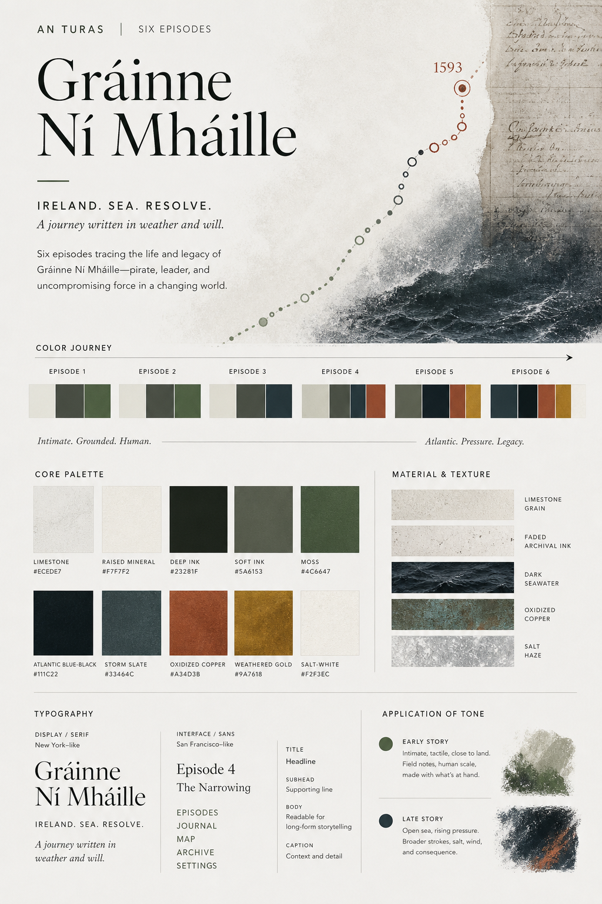
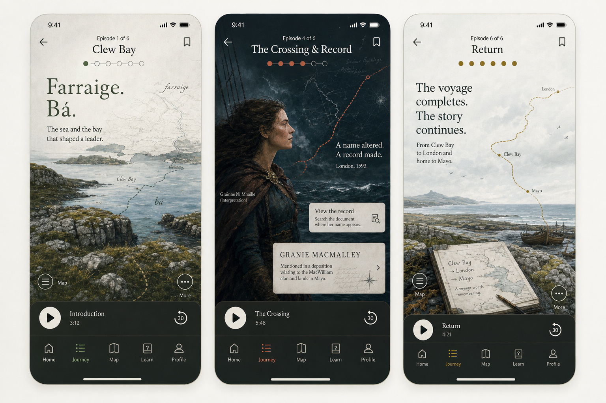

# Gráinne six-episode art direction

*Locked 13 July 2026 after palette review. This document is the durable visual
contract for the full Mayo prototype and should be read with
`GRAINNE-STORYBOARD.md`, `GRAINNE-LANGUAGE-WEAVE.md`, and `DESIGN.md`.*

This is the Mayo-specific application of the global editorial system in
`DESIGN.md`. The global rules now govern every surface: one visual or typographic
anchor; text-free image assets; live copy composed into negative space or a
full-width accessibility band; and text-led openings of equal visual intent when no
image adds meaning. The progression below adds Gráinne's story pressure without
turning its cinematic palette into general-purpose app chrome.

## Decision

The approved first encounter remains intimate, tactile, and documentary. Later
episodes become progressively more cinematic as the pressure around the 1593 journey
builds. The escalation comes from composition, scale, contrast, weather, motion, and
custom illustration—not from extra product chrome, fantasy spectacle, or invented
historical action.

The former abstract `GrainnePortraitMark` is not an acceptable representation of
Gráinne. Replace it with authored generated portraiture presented explicitly as an
interpretation. The story should also use custom illustrations of real places and
people, plus selective abstract or literary images when an inner pressure, contested
voice, loss, journey, or act of return cannot be carried well by literal scenery.

## Palette: one journey, not six themes

The existing limestone field journal remains the starting surface. Across the arc,
moss recedes and Atlantic blue-black, storm slate, oxidised copper, and weathered gold
gain weight. The app must still feel like one place; later episodes intensify the same
visual language rather than switching to a different brand.

| Role | Colour | Use |
| --- | --- | --- |
| Limestone | `#ECEDE7` | Early-story canvas and quiet reading field |
| Raised mineral | `#F7F7F2` | Source handling and focused language surfaces |
| Deep ink | `#23281F` | Primary type and early-story dark mass |
| Soft ink | `#5A6153` | Supporting copy and low-pressure structure |
| Moss | `#4C6647` | Place, origin, early interaction, Clew Bay |
| Atlantic blue-black | `#111C22` | Late-story field, open sea, state pressure |
| Storm slate | `#33464C` | Transitional surfaces, weather, distance |
| Oxidised copper | `#A34D3B` | Material pressure, fracture, consequential action |
| Weathered gold | `#9A7618` | The state paper, carried completion, Mayo gold |
| Salt-white | `#F2F3EC` | Type and marks on late-story dark fields |

Episode progression:

1. **Clew Bay:** limestone, deep ink, moss. Close to land and hand scale.
2. **Rockfleet:** limestone and moss with denser ink; held stone and household.
3. **The squeeze:** storm slate enters; framing tightens and routes fracture.
4. **The crossing and record:** Atlantic blue-black becomes structural; copper marks
   the name-find and the crossing into the English record.
5. **The answer:** darkest pressure; copper and weathered gold divide order from
   withheld effect.
6. **Return:** Atlantic field remains, but salt-white and weathered gold reopen the
   coast and complete the voyage chart.

Colour never carries episode state, evidence status, or completion alone. Text, shape,
position, and accessible labels remain authoritative.

## Illustration system

Use a coherent editorial image family rather than one repeated treatment:

- **Interpretive portraiture:** historically plausible, psychologically present,
  neither photographic impersonation nor heroic icon. No claim of likeness. Keep the
  interpretation disclosure in the accessibility description and opened evidence
  context, never stamped over the image or repeated as a decorative badge.
- **People and place:** Clew Bay, Rockfleet, the Atlantic crossing, and court/state
  spaces should be grounded in real geography, architecture, material, weather, and
  period research. Avoid generic castles and anonymous fantasy ships.
- **Documents:** surviving records remain evidence, not background texture. A generated
  document image must never masquerade as the archival object; use licensed facsimile
  when the learner is asked to inspect real wording.
- **Abstract/literary images:** permitted for paired hostile voices, pressure closing
  around a coast, loss of livelihood, a route becoming the only path, an answer that
  does not take effect, and memory returning to place. These images must clarify a
  dramatic idea rather than decorate a transition.
- **No costume drama:** no romantic pirate-queen poses, fantasy armour, flowing green
  gowns on cliffs, Tudor-pageant spectacle, shamrocks, Celtic knots, flags, or tourist
  emerald.

Each episode should have one dominant image and at most one secondary illustration.
Let source objects, Irish, and learner action carry the remaining screens.

All generated source images are text-free: no names, captions, dates, route marks,
labels, or typographic texture. The app owns every editorial line and places it in the
scene's authored negative space. Dominant images span the full story width; at standard
Dynamic Type sizes the location and headline may sit directly in that open field, while
accessibility sizes move them into a deliberate full-width band below the image. Never
shrink an illustration into a card merely to make room for adjacent copy.

## Cinematic escalation

- Episodes 1–2 use stable horizons, closer crops, calmer negative space, and subtle
  rise/settle motion.
- Episode 3 compresses the frame and introduces interruption, paired voices, and a
  visibly broken route without turning the learner into a combatant.
- Episode 4 opens spatially for the crossing, then narrows decisively onto the name at
  the head of the `SP 63/170` interrogatory. The name-find remains the single
  interactive climax.
- Episode 5 uses the strongest contrast and the most controlled withholding: the order
  is physically present, while the return line remains incomplete.
- Episode 6 restores breadth and air. Completion is the coast and voyage chart settling
  into one view—not confetti or a trophy reveal.

Reduce Motion replaces large travel, parallax, or staged reveals with immediate state
changes and short crossfades. No animation may delay reading or the Irish action.

## Typography and interface

New York–style system serif remains the voice of story, names, quoted language, and
evidence. San Francisco remains the interface voice. Later episodes can increase scale
and contrast, but controls, navigation, evidence access, and language interactions stay
native and consistent. The cinematic turn happens inside the story surface, never by
breaking iOS navigation.

## Implementation test

The prototype passes this direction only if:

- the six episodes read as one visual journey with perceptible escalation;
- Gráinne is represented by credible interpretive portraiture rather than the current
  abstract mark;
- real places, handled evidence, and selective literary images alternate with purpose;
- the palette reaches Atlantic blue-black without losing the limestone origin;
- the name-find, partial answer, return, and completed voyage chart each have distinct
  compositions;
- Dark Mode, Dynamic Type, VoiceOver, Increased Contrast, and Reduce Motion retain the
  complete account and every action.
